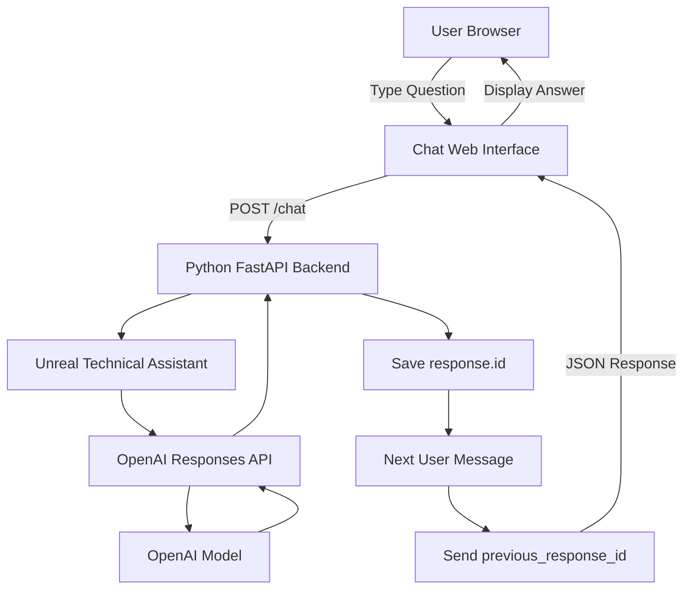

# ARCHITECTURE

```mermaid
flowchart TD

    U[User Browser]

    UI[Chat Web Interface]

    API[Python FastAPI Backend]

    A[Unreal Technical Assistant]

    OAI[OpenAI Responses API]

    RES[Save response.id]

    USRMEG[Next User Message]

    PREVID[Send previous_response_id]

    M[OpenAI Model]

    U -->|Type Question| UI
    UI -->|POST /chat| API
    API --> A
    A --> OAI
    OAI --> M
    M --> OAI
    OAI --> API
    API --> RES
    RES --> USRMEG
    USRMEG-->PREVID
    PREVID-->|JSON Response| UI
    UI -->|Display Answer| U
```
