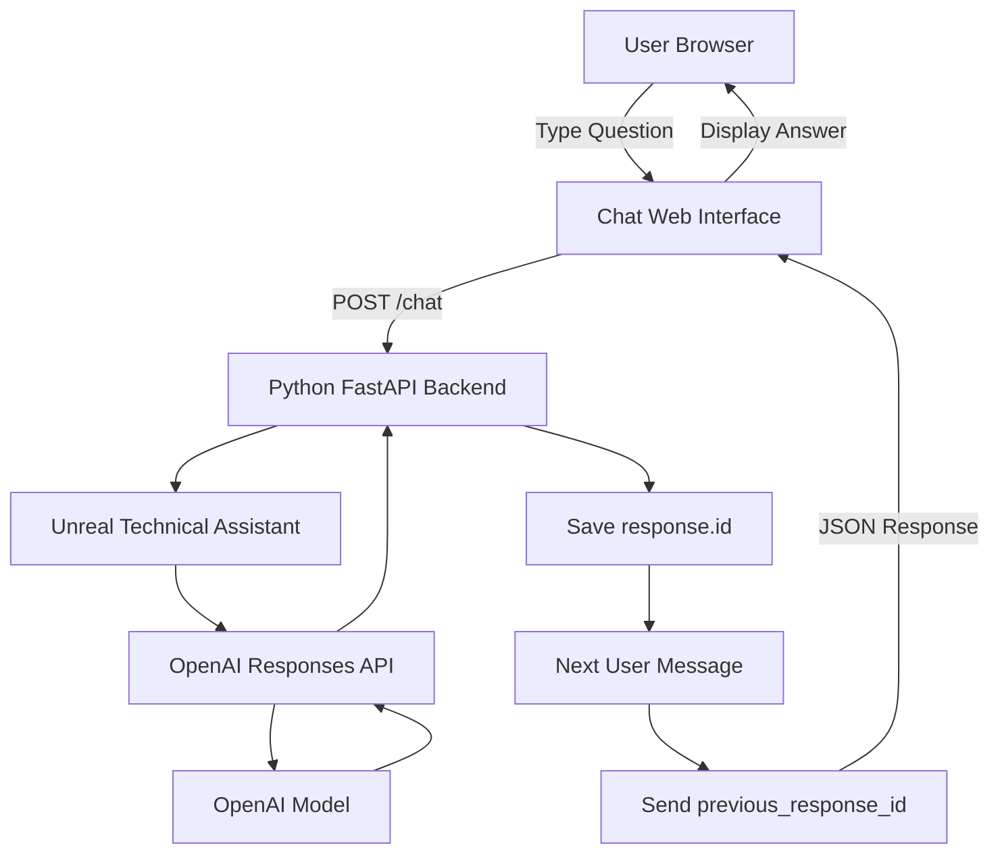

# Day 1 - Single Angent Architecture

# AGENT NAME:
    Unreal technnical Assistant
# GOAL:
    Hel user dialog to solve unreal engine 5 technical problems
# INPUT:
    User's unreal engine questions
# RULE:
    - Explain clearly
    - Give likly causes
    - Give practicle troubleshooting tips
    - Do not invent settings
    - Ask for missing information we needed
    ## Conversation Memory

The assistant must remember previous messages in the current chat session.

### Memory Strategy
- Use OpenAI Responses API conversation chaining.
- Store the latest `response.id`.
- Send it back as `previous_response_id` on the next request.
- Keep the same agent instructions on every request.
- Reset memory when the user clicks "New Chat".

### Flow

User Message
↓
Backend
↓
OpenAI Response
↓
Save response.id
↓
Next User Message
↓
Send previous_response_id
↓
Assistant remembers previous conversation
# OUTPUT:
    - Likely cause
    - Solve problem
    - Technical tips
    - Steps
    - Additional needed
    - Optimized outpit
    - Use bullet point,not #this symbol
# ARCHITECTURE
